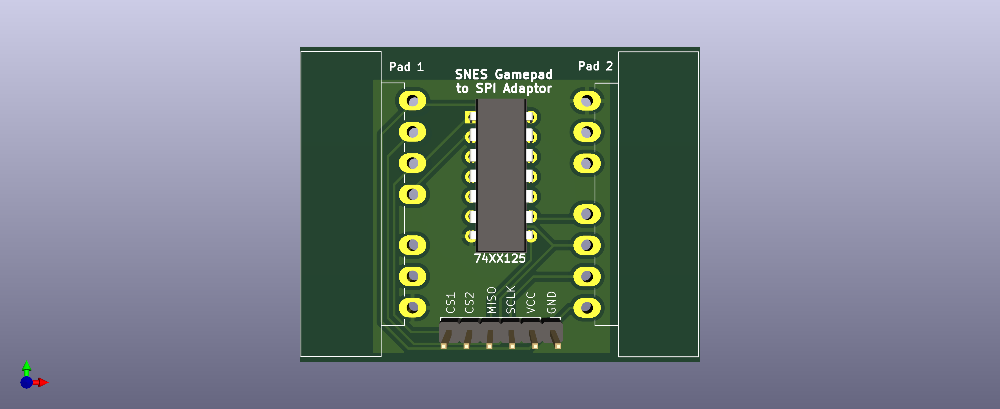

# SNES-Gamepads-to-SPI-Adaptor
A PCB that converts two SNES controllers to full SPI devices.

# Description
SNES controllers are already almost SPI type-1 devices if you use the CS pin as the controller's latch pin. This will already work on an SPI bus with one controller and no other devices present. To make other devices work on the same bus (a second controller as a notable example), you have to make the controller shut up when it is not used. The IC on this Adaptor board does exactly this for two SNES controllers.
The controllers share the SPI port's data, clock and power pins, but each controller requires its own chip select (CS) pin. For example, you can connect this adaptor directly with a Raspberry Pi, as its GPIO header exposes a SPI port with two CS pins.

# Why?
To fulfill retro gaming needs on various hardware, old and new. 

# Credits
Information about the SNES controller protocol and the IC being used are sourced from here:
https://circuitcellar.com/research-design-hub/projects/interfacing-with-video-game-controllers/
https://www.youtube.com/watch?v=NGiFlDPaB0o

KiCad-Libraries for the SNES controller port have been taken from here:
https://github.com/pdaehne/SNES-Userport-Adapter
